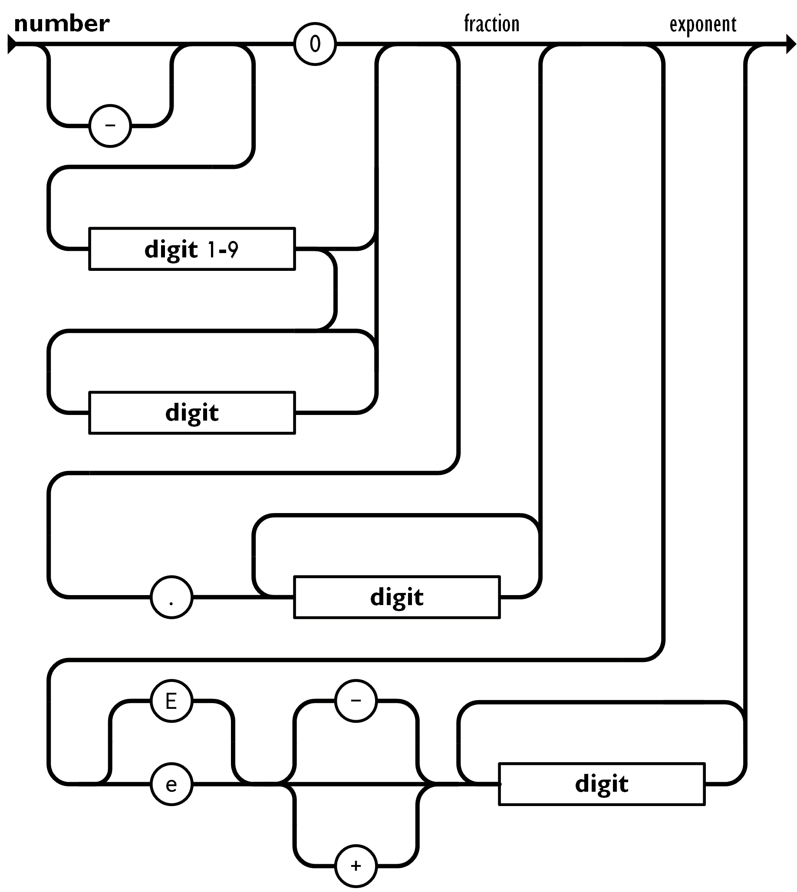

# JSON parser

The json-parser cli will scan a given file or stdin json blob and return `ok` if valid, otherwise it will print an error message.

## Usage

`-l` parameter toggles output from the lexical analysis step

```sh
$ cargo run -- -l test_files/full/pass1.json

$ echo '{"a": 1}' | cargo run -- 
```

## Test

To run the unit tests: `cargo test`

To run the integration tests: `./tests/integration_test.sh`

```sh
┌──────────────┬────────┬────────────────────────────────────────────────────────────────────────────────────────────┐
│ file         │ result │ output                                                                                     │
├──────────────┼────────┼────────────────────────────────────────────────────────────────────────────────────────────┤
│ fail1.json   │ pass   │ InvalidInitialState                                                                        │
│ fail2.json   │ pass   │ UnexpectedToken                                                                            │
│ fail3.json   │ pass   │ [line 1, position 1..2] Error: Unexpected character "u"                                    │
│ fail4.json   │ pass   │ UnexpectedToken                                                                            │
│ fail5.json   │ pass   │ UnexpectedToken                                                                            │
│ fail6.json   │ pass   │ UnexpectedToken                                                                            │
│ fail7.json   │ pass   │ [line 1, position 24..25] RightBracket "]" TrailingTokens                                  │
│ fail8.json   │ pass   │ [line 1, position 14..15] RightBracket "]" TrailingTokens                                  │
│ fail9.json   │ pass   │ UnexpectedToken                                                                            │
│ fail10.json  │ pass   │ [line 1, position 32..33] RightBrace "}" TrailingTokens                                    │
│ fail11.json  │ pass   │ [line 1, position 25..26] Error: Unexpected character "+"                                  │
│ fail12.json  │ pass   │ [line 1, position 23..24] Error: Unexpected character "a"                                  │
│ fail13.json  │ pass   │ [line 1, position 39..40] Error: Invalid number - no leading zeros "0"                     │
│ fail14.json  │ pass   │ [line 1, position 27..28] Error: Unexpected character "x"                                  │
│ fail15.json  │ pass   │ [line 1, position 1..29] Error: Invalid escape character ""Illegal backslash escape: "     │
│ fail16.json  │ pass   │ [line 1, position 1..2] Error: Unexpected character ""                                     │
│ fail17.json  │ pass   │ [line 1, position 1..29] Error: Invalid escape character ""Illegal backslash escape: "     │
│ fail18.json  │ fail   │ ok                                                                                         │
│ fail19.json  │ pass   │ UnexpectedToken                                                                            │
│ fail20.json  │ pass   │ UnexpectedToken                                                                            │
│ fail21.json  │ pass   │ UnexpectedToken                                                                            │
│ fail22.json  │ pass   │ UnexpectedToken                                                                            │
│ fail23.json  │ pass   │ [line 1, position 14..18] Error: Expected 'e' at index 3 of keyword "trut"                 │
│ fail24.json  │ pass   │ [line 1, position 1..2] Error: Unexpected character "'"                                    │
│ fail25.json  │ pass   │ [line 1, position 1..2] Error: Unescaped tab in string """                                 │
│ fail26.json  │ pass   │ [line 1, position 1..6] Error: Invalid escape character ""tab"                             │
│ fail27.json  │ pass   │ [line 1, position 1..6] Error: Unescaped newline in string ""line"                         │
│ fail28.json  │ pass   │ [line 1, position 1..7] Error: Invalid escape character ""line"                            │
│ fail29.json  │ pass   │ [line 1, position 1..3] Error: Expected digit after exponent "0e"                          │
│ fail30.json  │ pass   │ [line 1, position 1..4] Error: Expected digit after exponent "0e+"                         │
│ fail31.json  │ pass   │ [line 1, position 1..4] Error: Expected digit after exponent "0e+"                         │
│ fail32.json  │ pass   │ UnexpectedToken                                                                            │
│ fail33.json  │ pass   │ UnexpectedToken                                                                            │
│ pass1.json   │ pass   │ ok                                                                                         │
│ pass2.json   │ pass   │ ok                                                                                         │
│ pass3.json   │ pass   │ ok                                                                                         │
└──────────────┴────────┴────────────────────────────────────────────────────────────────────────────────────────────┘
pass: 35
fail: 1
```

Test case `fail18.json` is accepted to be non passing as the parser can accommodate a higher level of nesting than specified by json.org.

## Parsing JSON

Parsing is done in two steps:

1. Lexical analysis
2. Syntactic analysis

> Technically these steps can be combined into a single step, but I found it a better learning experience to separate them, and it makes the code easier to read.

### Lexical analysis

Lexical analysis is the process of converting a sequence of characters into a sequence of tokens.

#### Tokens

Tokens are the smallest unit of a language. In this case, the tokens are:

- `LeftBrace`
- `RightBrace`
- `LeftBracket`
- `RightBracket`
- `Colon`
- `Comma`
- `String`
- `Number`
- `Boolean`
- `Null`

#### Lexemes

Lexemes are the sequence of characters that make up a token. For example, the lexeme for the `LeftBrace` token is `{`. The lexeme for the `String` token is the string value, for example `"hello"`.

#### Process

In order to perform the lexical analysis step, we first implement a SourceScanner. The SourceScanner is responsible for reading the source file and returning the next character. The SourceScanner is then passed to the Lexer, which is responsible for reading the source file and returning the next token.

```rust
// initialize the source scanner with an input string
let mut source_scanner = SourceScanner::new(&source);
// consume the current character and advance to the next
let char1 = source_scanner.advance();
// look at the next character without advancing
let char2 = source_scanner.peek();
```

The Lexer is implemented as a state machine. The state machine is initialized with the source scanner and the current character. The state machine then advances through the source file, consuming characters and returning tokens.

The next state at each step is determined by peeking at the next character and the current state. For example, if the current state is `Start` and the next character is `{`, then the next state is `LeftBrace`. If the current state is `LeftBrace` and the next character is `:`, then the next state is `Colon`.

Each state is processed by a function that implements the logic matching the railroad diagram for the state. The railroad diagrams are found further down the page in the 'JSON structure reference' section.

```rust
match scanner.peek() {
  '{' => self.match_symbol(scanner, '{', TokenType::LeftBrace),
  '}' => self.match_symbol(scanner, '}', TokenType::RightBrace),
  '[' => self.match_symbol(scanner, '[', TokenType::LeftBracket),
  ']' => self.match_symbol(scanner, ']', TokenType::RightBracket),
  ':' => self.match_symbol(scanner, ':', TokenType::Colon),
  ',' => self.match_symbol(scanner, ',', TokenType::Comma),
  't' => self.match_keyword(scanner, "true", TokenType::Boolean),
  'f' => self.match_keyword(scanner, "false", TokenType::Boolean),
  'n' => self.match_keyword(scanner, "null", TokenType::Null),
  '"' => self.match_string(scanner),
  '0'..='9' | '-' => self.match_number(scanner),
  _ => {
      scanner.advance();
      Err("Unexpected character".to_string())
  }
}
```

The lexer returns a vector of tokens. The tokens are then passed to the parser.

The output of the lexical analysis step can be printed to the console by passing the `-l` flag to the cli. For example, running `echo '{"a": 1}' | cargo run -- -l` will print the following:

```sh
[line 1, position 0..1] LeftBrace "{"
[line 1, position 1..4] String ""a""
[line 1, position 4..5] Colon ":"
[line 1, position 6..7] Number "1"
[line 1, position 7..8] RightBrace "}"
ok
```

A lexically incorrect input will return an error, for example `echo '{"a":a1}' | cargo run -- -l ` will print:
```sh
[line 1, position 6..7] Error: Unexpected character "a"
```

A lexically correct but syntactically incorrect input will still be able to complete the lexing step, but return an error on the next phase of syntax analysis, for example `echo '{"a": 1,}' | cargo run -- -l ` will print:
```sh
[line 1, position 0..1] LeftBrace "{"
[line 1, position 1..4] String ""a""
[line 1, position 4..5] Colon ":"
[line 1, position 6..7] Number "1"
[line 1, position 7..8] Comma ","
[line 1, position 8..9] RightBrace "}"
UnexpectedToken
```

### Syntactic analysis

Syntactic analysis is the process of analyzing a sequence of tokens to determine if it is a valid sentence in the language. Since we have already verified that the tokens are valid, we can limit this step to check that the objects and arrays are valid (see the railroad diagrams for details). A similar scanner class, this time for tokens, is used to iterate through the list. 

At first glance it may seem that you can solve the syntactic analysis step with a simple FSM. However, this is not the case. The reason is that the language is nested. 

 For example, the following is a valid json object:
```json
{
  "a": {
    "b": {
      "c": {
        "d": [
          {
            "e": 1
          },
          {
            "f": 2
          },
        ]
      }
    }
  }
}
```

Each time a nested array or object is encountered we need to push the current state onto a stack and initiate a new sub FSM. When the nested array or object is complete, we pop the previous state off the stack and continue. This technique is known as a pushdown automation (PDA). 

An alternative approach is to use a recursive descent parser. This approach is simpler to implement, but has the downside of being vulnerable to stack overflow errors. The PDA approach is more complex, but is guaranteed to not overflow the call stack. (Technically the PDA state stack could grow extremely large and overflow, but this is unlikely to happen in practice.)

### JSON structure reference

JSON (JavaScript Object Notation) is a simple data format based on javascript that is easy to read and write.
JSON is a context free grammar specified [here](https://www.json.org/json-en.html).

### Object


### Array


### Value


### String


### Number


### Whitespace

